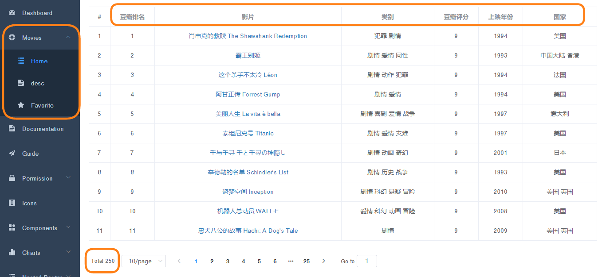
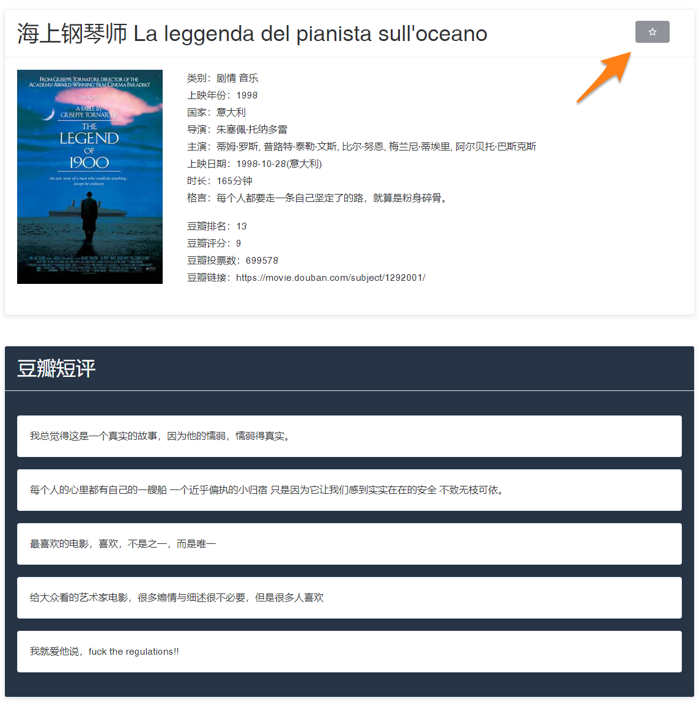
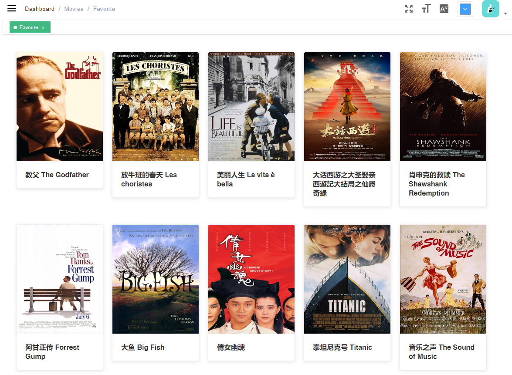
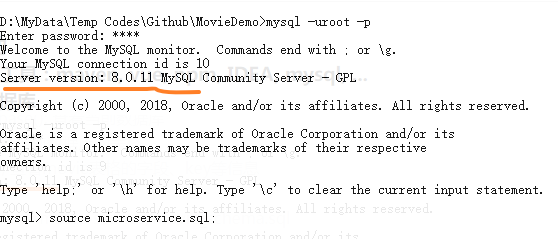
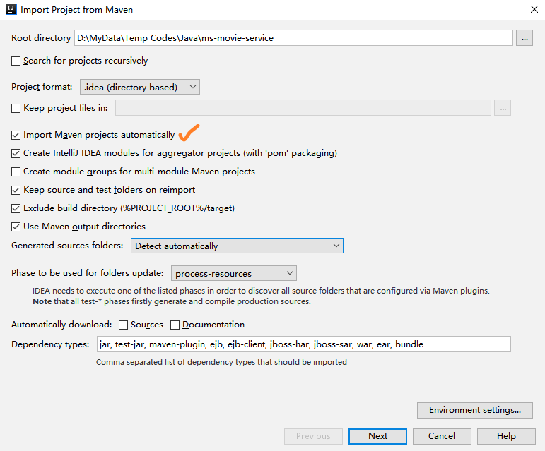
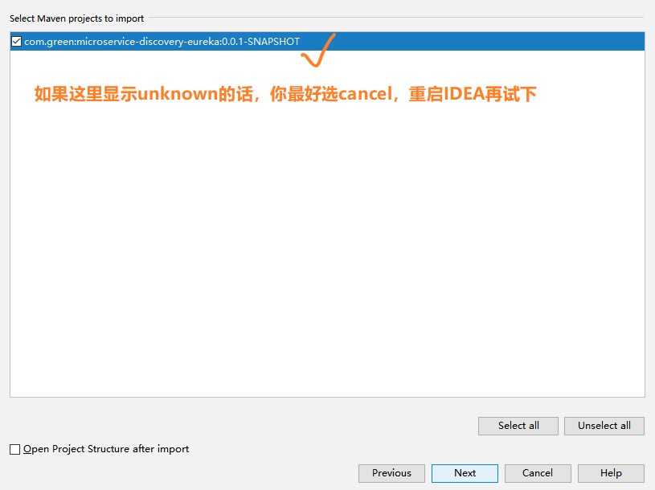
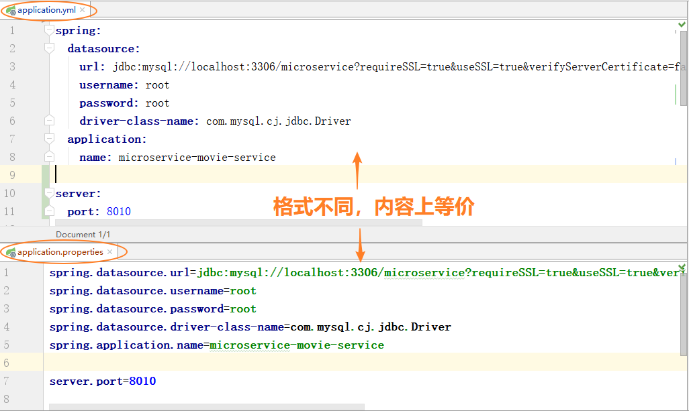
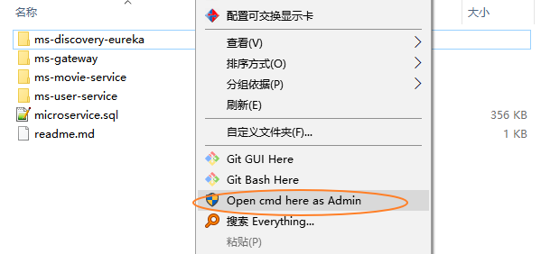

## 1.Brief Intro
一个简单的SpringCloud微服务Demo项目（toy example）
* 功能：用户可以从网站查询到电影信息，并将电影添加都收藏夹
* 技术：前端vue + 后端Spring Cloud + 数据库mysql
* 数据：来源于豆瓣top 250电影，仅用于测试学习
* 用处：功能虽然简单，这个小型的玩具项目还是可以用来学习Spring Cloud配置时测试、演示功能

【注】因为这篇readme定位是教程类型，所以可能写得比较啰嗦。本人水平有限，如果有写错的地方，大家可以提交修改请求或发布issue（毕竟我真的很菜，还请dalao们多多指教_(:з」∠)_

<!-- <div align="center" padding="20px"> -->
<!-- ; </div> -->






## 2.项目启动
### 2.0. 环境 / 工具：maven, vue, npm, IDEA, mysql, ...
### 2.1. 导入数据库


1. 在MoiveDemo的目录下，进入CMD（注：有关CMD的操作，拉到页面最下的[tips]部分），进入mysql
2. 敲下命令：source microservice.sql; 运行文件中的sql语句，新建数据库表格，导入数据
3. 用以下命令熟悉microservice数据库的schema：
   1. select database(); 查看当前数据库
   2. show tables; 当前数据库的表格
   3. desc movie; 查看movie表格的字段、key等信息
4. 具体的sql语句
   * movie表格：ms-movie-service/movie_schema.sql
   * user表格：ms-user-service/user_schema.sql

### 2.2. maven项目导入IDEA
1. 用IDEA [import Project]，选中项目目录下的pom.xml文件
2. 勾选自动导入Maven项目，这样IDEA就会在项目打开后自动导入pom.xml中配置的SpringBoot依赖、插件等（需要连接网络）
3. 后面一直Next即可
4. 修改application.yml中的mysql用户、密码（注意：这几个微服务项目用的mysql配置是和mysql 8.0.11版本一致的，并且使用了ssl。mysql版本不同，配置是不一样，如果踩坑遇bug了，请自行搜索或查阅官方文档）
5. 重复1-4，导入ms-movie-service，ms-user-service，ms-gateway，ms-discover-eureka




### 2.3. Maven打包项目
在Maven项目路径下，cmd输入：
1. mvn clean compile
2. mvn clean package
即可把项目打包成Jar
可以看到项目目录下，生成了target文件夹，target目录下包含了项目的Jar包
打包项目：ms-discovery-eureka, ms-gateway
tips: 也可以在IDEA的Terminal窗口中使用CMD


### 2.4. 前端
CMD进入vue-element-admin路径，安装依赖包：npm install
【注】前端是从开源的Vue项目vue-element-admin稍微改改就拿来用的。毕竟没有前端，自己写的后端只能用postman和浏览器地址栏来测试响应的JSON，很尴尬的_(:з」∠)_ 因为本人前端知识几乎为0，所以项目改得很粗糙，例如登录验证只能用admin这个账号……将就着用吧。有兴趣的话，可移步vue-element-admin的github仓库和vuejs的官网阅读文档
vue-element-admin: https://github.com/PanJiaChen/vue-element-admin
vuejs: https://cn.vuejs.org/

### 2.5. 启动项目
1. 服务发现组件
在系统hosts文件中添加这一行：127.0.0.1 peer1 peer2
在CMD中进入target文件夹，运行ms-discovery-eureka：
   * 启动eureka服务发现组件peer1：java -jar microservice-discovery-eureka-0.0.1-SNAPSHOT.jar --spring.profiles.active=peer1
   * 打开另一个CMD，启动peer2：java -jar microservice-discovery-eureka-0.0.1-SNAPSHOT.jar --spring.profiles.active=peer2
2. 启动ms-gateway的Jar包
3. 直接在IDEA中启动ms-movie-service和ms-user-service
4. CMD进入vue-element-admin，启动前端：npm run dev
5. 随便看看，点一点，enjoy yourself

## 3.关于Spring Boot你需要知道这些
* pom.xml 依赖文件
* application.yml 或 application.properties 配置文件
* 3.3 RestController响应HTTP方法
* mybatis mapper：java接口 / xml文件

### 3.1. pom.xml：Maven项目管理依赖的配置文件
包含了Spring Boot, Spring Cloud的各种依赖、插件等。pom.xml文件就好比是Spring Boot项目的“科技管理中心”。
举个例子，只要在pom.xml文件中加入mybatis和mysql的依赖，IDEA就会自动导入mybatis和mysql的java库，之后就可以很方便地在整个项目中使用mybatis注解来访问mysql数据库了

```
<dependency>
	<groupId>org.mybatis.spring.boot</groupId>
	<artifactId>mybatis-spring-boot-starter</artifactId>
	<version>1.3.2</version>
</dependency>

<dependency>
	<groupId>mysql</groupId>
	<artifactId>mysql-connector-java</artifactId>
	<version>8.0.11</version>
	<scope>runtime</scope>
</dependency>
```

### 3.2. application.yml / application.properties：Spring Boot的配置文件
配置项目所需各种属性参数，例如Spring Boot的数据库信息、端口号、日志等等等，各种依赖（比如eureka, zuul）的配置参数
两者只是格式不同而已，内容上是等价的。按个人偏好选其中一个即可
* yml（yet another makeup language）采用严格的缩进形式，属于标记语言
* properties 采用面向对象语言的属性访问方式


### 3.3. RestController：后端响应、处理HTTP请求的接口
当你熟悉了面向对象编程的逻辑之后，开始接触Spring Boot时你可能会摸不着头脑。整个项目的启动类XXApplication.java的main方法只有一行：
```
public static void main(String[] args)
{
    SpringApplication.run(XXApplication.class, args);
}
```
完全没有像平常编程一样的逻辑：新建类，调用类的方法，各个类之间相互协作……
其实呀，像Spring Boot这种黑箱子，帮我们做了很多事情，只要写少量的代码就可以提供后端的服务了，Controller（或RestController）正是Spring Boot这个黑箱子和外界交互的接口。
在类的定义前标注@Controller，这个控制器类就可以响应HTTP方法了
而@RestController = @Controller + @ResponseBody，被标注为@RestController的类，方法接受的参数、返回值都是JSON格式的，很方便

- [ ] 占坑，后续更新

### 3.4. Mapper：Mybatis读写数据库的接口
创建mapper接口，在抽象方法的定义上标注@Select, @Insert, @Delete, @Update等注解，并填写相关的sql语句，即可读写数据库
具体见：ms-movie-service/src/main/.../mapper/MovieMapper.java中的代码

### 3.5. 一种简单的Spring Boot后端架构
controller响应HTTP请求，调用service层的服务处理请求，service层调用mapper层的接口读写数据库


## 4.Spring Cloud微服务架构
### 4.1. 项目架构
后端拆解为：
* 微服务发现组件 service discovery
* 网关 gateway
* 两个微服务：movie-service和user-service


### 4.2. 项目的组件和API

|componet|port num|api|
|:-:|:-:|-|
|frontend|9752||
|eureka-server|peer1 8761<br> peer2 8762||
|gateway|8080|路由<br>/movie/** -> microservice-movie-service<br>/user/** -> microservice-user-service|
|ms-movie-service|8010|GET /moviesInfo <br>GET /moviesCount <br>GET /desc<br>PUT /collection<br>GET /collection<br>DELETE /collection<br>GET /collection/collections|
|ms-user-service|8000|POST /login<br>POST /signUp<br>GET /id<br>|

## #Tips
便捷地让CMD进入某一路径下：
在文件浏览器[windows explorer]窗口中，按住[shift]，鼠标右键，点击[Open cmd here]即可
